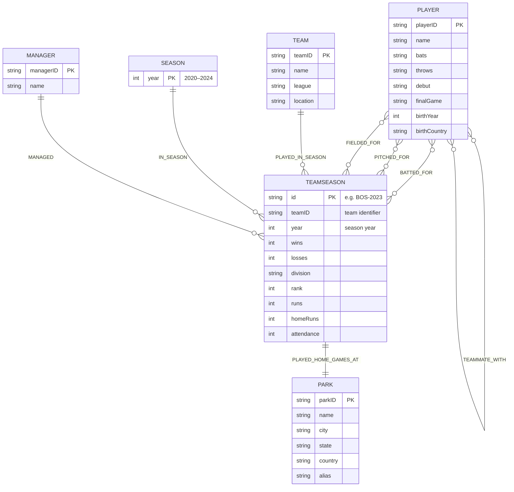

### Introduction
This project reflects the creation and use of a Neo4j graph database implemented to cover the 2020-2024 MLB seasons. The database contains statistics from MLB seasonal and player performance data but does not include post season coverage. NoSQL is suitable for this domain as the MLB naturally contains a relationship heavy structure. Players "play for" teams in a season, players "hit" certain batting statistics, players "pitch" and "field" certain statistics as well. These types of relationships are fundamental to the structure of a graph database that connects nodes to each other using complex relationship types
### Domain: Problem Definition
At the core of this project is the Lahman Baseball Database, which was created by Sean Lahman. The database is extensive and contains statistics from seasons ranging from 1871 through 2024. The database itself has been explored extensively using relational databases, and is a widely explored topic. The database provides comma delimited csv files for different statistical categories including pitching, batting, fielding, teams, people, managers, parks, and more. The database is flush with statistics and can be used to expand a wide range of projects and approaches to such a topic.

While it is possible to implement the database and use it in an SQL friendly manner, a graphical approach allows us to take advantage of the relationships that are fundamental to the core of baseball. Graph databases allow for a natural representation of different teammates, seasons, and collective performance. By implementing the data in a graphical way, queries can traverse the graphs quickly, while also offering an opportunity for visual analysis. Like any sports league, relationships amongst participants are complex. Apart from traditional connections such as teammate and roster relationships, it is also intuitively possible to represent things such as development arcs, or how players might be connected by sharing teammates at different times in their careers. A graph database can naturally represent these many-to-many relationships. Relational databases would struggle with these deep chains of connections as they lack a structural way to do so. Subsequently it would be difficult to analyze paths of connection, whether it is developmental paths as a player moves or is traded from one team to another, or simply evaluating which players share a teammate. The created database has the ability to identify teammate connections and their shared development paths, view and navigate manager-to-player influence paths, analyze seasonal rosters, and traverse across different seasons.
### System Design
While the database is extensive, it was decided to only use data from the 2020-2024 seasons. The structure of the database itself grows exponentially as more data is included since it is a many-to-many structure. With more resources (and true NoSQL structuring of the system) it would be possible to include a wider range of data spanning as far back as the Lahman database will go.

The graph database itself has six different node types, each of which have different properties. These node types are: Player, Team, Season, Manager, TeamSeason, and Park. Teamseason is the "central" node and is created by combining statistics from a specific team during any given season. The Player and TeamSeason nodes have relationships with one another to demonstrate "BATTED_FOR", "PITCHED_FOR", and "FIELDED_FOR" relationships. Players are connected to one another with "TEAMMATE_WITH" relationships. Managers "MANAGED" TeamSeasons, while Teams are linked to TeamSeasons with "PLAYED_IN_SEASON" relationships, which will continue to connect TeamSeasons with a Season node with a "IN_SEASON" relationship. A TeamSeason also connects to a specific Park by using the relationship "PLAYED_HOME_GAMES_AT".

For a comprehensive view of the schema, refer to the following chart:


Each node has a unique identifier to help with query speed and accessibility. To access a specific player node, a user simply needs to reference the unique playerID; this carries true for all other nodes in the database itself.

There were a couple of design choices that went in to creating the schema in this way. The TeamSeason node was used, as opposed to just Season, in order to connect valuable details between a season and a player. The creation of this node ultimately allows a player's performance and statistics to be connected to a single TeamSeason which can immediately demonstrate their impact. The season nodes themselves do not carry detailed information, which paves the way for a more inclusive TeamSeason node to hold diverse information. Furthermore, connecting teammates to each other is a central component to this structure. Forging this connection makes interesting traversal queries possible beyond finding who was a teammate with who. Since a teammate structure exists, users of the database are able to query to discover how players might be connected to one another.
### Implementation
The database was implemented using Neo4j's desktop client. After installing the client, an instance of Neo4j was created and the MLB database itself was forged. From this point, creating the database came down to importing the data from the csv files provided by Lahman's database. After then creating the relationships between nodes, the database was ready to be interacted with.

In the desktop client itself, the user is able to interact with the database to conduct a number of interesting queries. Please find examples of these queries and their output below.

Finding 5 teammates of Rafael Devers
```
MATCH (p:Player {name:"Rafael Devers"})-[:TEAMMATE_WITH]-(t:Player)
RETURN t.name
LIMIT 5;
```
![[Screenshot 2025-12-03 at 2.50.46 PM.png]]
Finding how two players are connected: Rafael Devers and Brandon Nimmo
```
MATCH path = shortestPath(
(:Player {name:"Rafael Devers"})-[:TEAMMATE_WITH*1..10]-(:Player {name:"Brandon Nimmo"})
)
RETURN path;
```
![[Screenshot 2025-12-03 at 2.52.15 PM.png]]
Finding 5 players with the same team path; A minimum of 2 different teams
```
MATCH (p:Player)-[:BATTED_FOR|PITCHED_FOR|FIELDED_FOR]->(ts:TeamSeason)
WITH p,
     collect(DISTINCT ts.id) AS path,
     collect(DISTINCT split(ts.id, "-")[0]) AS teams
WITH path, teams, collect(p) AS players
WHERE size(players) > 1
  AND size(teams) > 1
UNWIND players AS p1
UNWIND players AS p2
WITH p1, p2, path, teams
WHERE id(p1) < id(p2)
RETURN
  p1.name  AS player1,
  p2.name  AS player2,
  path     AS sharedDevelopmentPath,
  teams    AS teamsInPath
ORDER BY size(path) DESC
LIMIT 5;
```
![[Screenshot 2025-12-03 at 2.54.04 PM.png]]

The above results are taken directly from the Neo4j desktop client after querying the database. 

Beyond interacting with the database directly, the MLB app that was created can be used to test run a few of these queries. The app itself contains a range of built in queries but does therefore create some limitations. For full control over query type and graph traversal, the database should be interacted with directly. The application is a simple command line interpreter that allows the user to select query types in a menu. It then prompts the user for specific input information such as the player ID and TeamSeason ID before efficiently displaying the results.
### Analysis and Reflections
Working with Neo4j to create this project was really interesting and surprisingly intuitive. During class lectures, I really liked the idea of a graph database simply because of how it can demonstrate complex relationships natively. That said, I was confused on what it would actually look like, and how the data itself would be represented. After getting a chance to actually interact with a database, I discovered it was as intuitive as it looked.

Throughout my development, I came across a number of different obstacles. As with any other type of project, obtaining clean and consistent data can be difficult. While the Lahman Dataset was fantastic for my use cases, it did not come without flaws. In some instances, baseball parks did not have names, managers were missing valuable information like their names, and seasons ceased to exist. It took a good amount of time to make the data a bit more consistent in its presentation, which was required to create meaningful schemas for querying. With that said, the database that I created still has its own flaws. While ranging from 2020 to 2024 was a good decision for the scope of the assignment (as it is, the database has over 190,000 connections between over 3,300 nodes), it did impact some of my design choices. With further expansion of the data, and a continuation of the schema, there would be endless possibilities for pushing the application even further. As an example, finding like development paths for a player over a short time frame can seem irrelevant and difficult (though such paths do exist). With an expansion of the data, it would be interesting to see how these features subsequently evolve to show more interesting results. 

One of the best aspects about working with the Neo4j desktop client (and Neo4j in general), is its interface itself. I found it incredibly easy to query and subsequently fascinating to inspect the results of certain queries. For example, querying to find players who are connected by shared teammates was intuitive, and the result was a small graph of exactly how these players are connected. Furthermore, the client gives exact references to how long such queries take to execute, which is a valuable tool. Between relatively easy query creation and lightning fast results, Neo4j was easily the correct implementation for such a design choice. I also found creating the command line app to be beneficial as well. I was worried that connecting the database to an application would be difficult, but Neo4j made that extremely easy as well. Of course this is all run locally, so it is assumed that at a distributed level things might be a bit more challenging.

During the initial stages of project planning I did consider using a document database instead. Part of this appeal was the way that documents allow users to embed other documents, or contain references to other documents. While this could have been a valuable implementation, it quickly became evident that this sort of document database is almost graphical (without connections of course) in and of itself, which ultimately led to me choosing Neo4j's graph database. 
### Conclusion
NoSQL Database Systems offer unique ways to interact with data at a large scale. Where relational databases would be slow to show complex relationships, NoSQL systems excel with speed. Using a graph database to demonstrate some of the many complex relationships that exist in Major League Baseball was the perfect opportunity for me to explore the benefits of NoSQL systems. Quick traversal across a graphical structure to demonstrate interesting relationships that are central to baseball create a logical and exciting way to interact with a piece of sporting history.