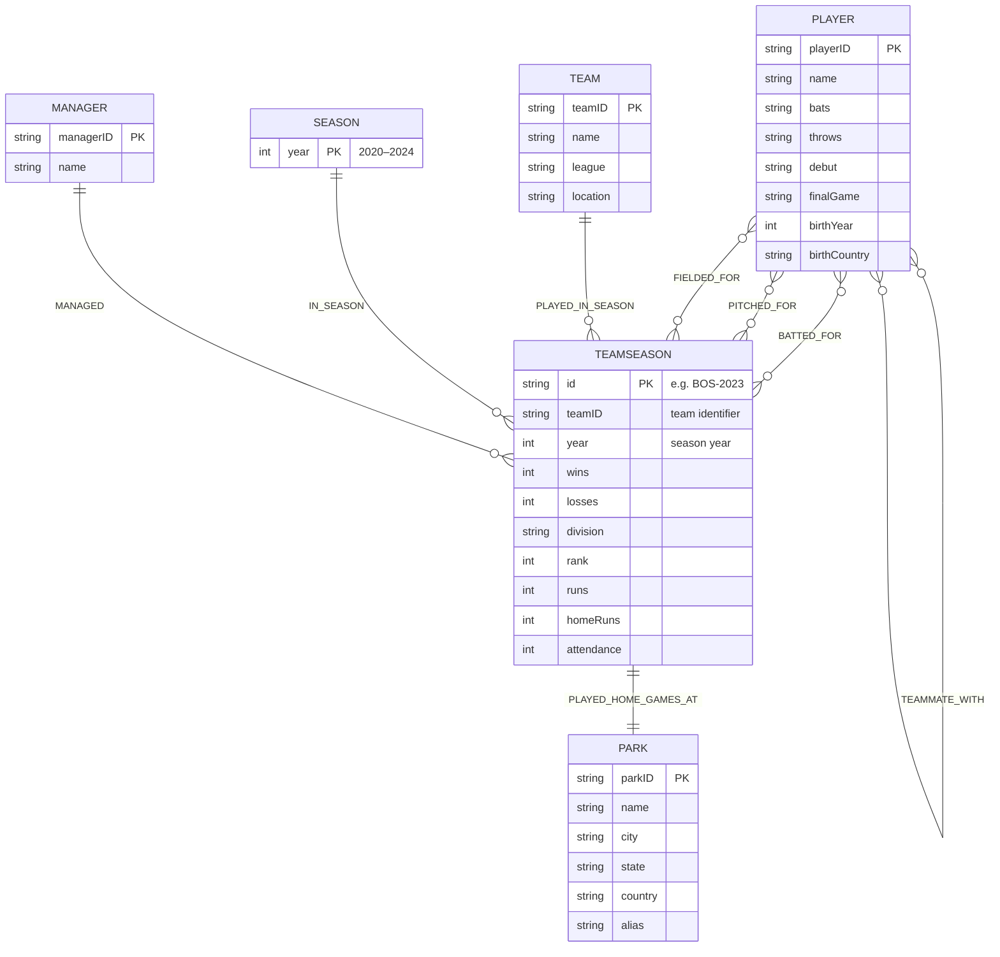

# MLB Graph Database (2020-2024)
*A NoSQL Final Project: Neo4j Graph Data Model of Modern MLB Seasons*

This project creates a Neo4j graph database for **Major League Baseball** from the 2020-2024 seasons. The database includes players, teams, managers, parks, team-season performance, and individual player statistics. The graph structure of the database enables traversal based queries that are typically difficult to complete on a relational (SQL) model. These include but are not limited to teammate network paths, shared development histories, and manager-tree connections.

## Contents

1. Project Goals
2. Data Source & Scope
3. Graph Schema
4. Relationship Types & Properties
5. Constraints & Indexes
6. How to Use the Dump File
7. Example Queries
8. Using the mlb_app.py File
9. Conclusion
## Project Goals

1. To model recent MLB data from the 2020-2024 seasons in a graph database using Neo4j.
2. To capture **traditional relationships**, such as players -> teams, teams -> seasons and **graph-unique relationships**, like:
	1. "How are Player A and Player B connected through teammates?"
	2. "Which players shared multiple teams and seasons together?"
	3. "Show a player's team-path over time, and other players with the same journey."
	4. "Which players were managed by the same people at different times?"
3. To enable performance based analysis using valid baseball statistics.
4. To provide a clean and well defined schema that is suitable for future extensions into predictive or visualization tools.
## Data Source & Scope

This database uses data that is derived from the **Lahman Baseball Dataset**, which is then filtered to only include data from 2020-2024. This is done to keep the graph relatively small, fast, and focused on the modern era. With more resources and a larger distributed system, it is entirely possible to extend the seasons in the database as the Lahman Baseball Dataset is extensive.

CSV files that are used for the database (can be found in the corresponding folder):
- People.csv (player biographical data)
- Teams.csv (team info and seasonal performance)
- Managers.csv (information about specific managers for a team)
- Parks.csv (generic ballpark information)
- Batting.csv (hitting statistics related to players in the people csv)
- Pitching.csv (pitching statistics related to players in the people csv)
- Fielding.csv (fielding statistics related to players in the people csv)
All CSV files are placed in the **Neo4j import directory**
## Graph Schema

The schema is designed around the core entities of the MLB ecosystem.

1. **Player**
```
	Player {
		playerID: string (unique)
		name: string
		bats: string
		throws: strng
		debut: string
		finalGame: string
		birthYear: int
		birthCountry: string
	}
```
2. **Team**
```
	Team {
		teamId: string (unique)
		name: string
		league: string
		location: string
	}
```
3. **Season**
```
	Season {
		year: int (2020-2024)
	}
```
4. **TeamSeason**
```
	TeamSeason {
		id: string ("BOS-2023")
		teamid: string ("BOS")
		wins: int
		losses: int
		division: string
		homeRuns: int
		rank: int
		runs: int
		year: int
		attendance: int		
	}
```
5. **Manager**
```
	Manager {
		managerID: string
		firstName: string
		lastName: string
		name: string
	}
```
6. **Park**
```
Park {
	parkID: string
	country: string
	city: string
	state: string
	name: string
	alias: string
}
```
## Relationship Types & Properties
#### Player -> TeamSeason (Performance)
**Batting**
```
	(:Player)-[bp:BATTED_FOR]->(:TeamSeason)
	bp {
		year: int,
		stint: int,
		IBB: int,
		HR: int,
		SB: int,
		2B: int, 
		CS: int, 
		R: int, 
		SF: int, 
		SH: int, 
		HBP: int, 
		RBI: int, 
		SO: int
	}
``` 
**Pitching**
```
	(:Player)-[pp:PITCHED_FOR]->(:TeamSeason)
	pp {
		BB: int,
		IPouts: int,
		SV: int,
		stint: int,
		G: int,
		W: int,
		H: int,
		HR: int,
		SO: int,
		GS: int,
		L: int,
		ER: int
	}
```
**Fielding**
```
(:Player)-[fp:FIELDED_FOR]->(:TeamSeason)
fp {
	InnOuts: int,
	A: int,
	stint: int,
	pos: string,
	E: int,
	G: int,
	GS: int,
	DP: int,
	PO: int
}
```
#### Team <-> TeamSeason <-> Season
```
(:Team)-[:PLAYED_IN_SEASON]->(:TeamSeason)-[:IN_SEASON]->(:Season)

```
#### Manger -> TeamSeason
```
(:Manager)-[:MANAGED]->(:TeamSeason)
```
#### Player <-> Player (Teammates)
Undirected, stored one way.
```
(:Player)-[:TEAMMATE_WITH { 
    firstSeasonTogether:int,
    lastSeasonTogether:int,
    teams:[string],
    seasons:[int]
}]->(:Player)

```
#### TeamSeason <-> Park
```
(:TeamSeason)-[:PLAYED_HOME_GAMES_AT]->(:Park)
```
#### Schema Diagram with Relationships

## Constraints & Indexes

These ensure data integrity and faster queries:
```
CREATE CONSTRAINT player_id IF NOT EXISTS
FOR (p:Player) REQUIRE p.playerID IS UNIQUE;

CREATE CONSTRAINT team_id IF NOT EXISTS
FOR (t:Team) REQUIRE t.teamID IS UNIQUE;

CREATE CONSTRAINT season_year IF NOT EXISTS
FOR (s:Season) REQUIRE s.year IS UNIQUE;

CREATE CONSTRAINT ts_id IF NOT EXISTS
FOR (ts:TeamSeason) REQUIRE ts.id IS UNIQUE;

CREATE CONSTRAINT manager_id IF NOT EXISTS
FOR (m:Manager) REQUIRE m.managerID IS UNIQUE;

CREATE CONSTRAINT park_id IF NOT EXISTS
FOR (p:Park) REQUIRE p.parkID IS UNIQUE;
```
## How to Use the Dump File

Using the dump file is the fastest and most reliable way to reproduce this database.
It restores:
- All nodes
- All relationships
- All computed teammate links
- All constraints
- All indexes
1. Clone the GitHub repository that this work is in, I recommend cloning to your desktop:
	git clone https://github.com/aidanrohm/NoSQL-Final-Project.git	 
2. Install Neo4j Desktop
	https://neo4j.com/download/
3. Create a New Instance
	1. Give this instance a name
	2. Set the instance password. This password will be used in the mlb_app.py script to connect to the database
	3. Stop the instance if it starts automatically
4. Download the .dump file from this GitHub repository to a location on your machine that you can easily navigate to
5. Select the three horizontal dots next to the instance you have just created
6. Select "Load database from file"
7. Select "Browse" and find the .dump file
8. The instance will now install the database as expected

NOTE: It is possible that you may need to bring the imports to the import tab if you would like to modify the database. You would need to do this specifically if you desire to increase the data coverage range, or if a query that should would gives a response such as "No records, no result." To give your database the context of these files, literally drag and drop them from the Imports directory to the Imports tab in Neo4j.

To directly query the database without using the mlb_app.py application, you can:
1. Run the instance
2. Select the Query Tool from the left tab
3. Select the running instance from the top dropdown menu that will default with "No instance connected"
4. Select the MLB database from the Database dropdown menu
5. Use the Cypher interpreter on the right to interact and query with the database
## Example Queries

**Find all teammates of Rafael Devers**
```
// Enables the traversal of the graph to locate instances with the following pattern
MATCH (p:Player {name:"Rafael Devers"})-[:TEAMMATE_WITH]-(t:Player)
RETURN t.name;
```
**Find how two players are connected (Rafael Devers and Brandon Nimmo)**
```
// Uses traversal of the graph but takes advantage of the shortestPath() function to return a connection with the least hops
MATCH path = shortestPath(
(:Player {name:"Rafael Devers"})-[:TEAMMATE_WITH*1..10]-(:Player {name:"Brandon Nimmo"})
)
RETURN path;
```
**Find 10 players who share the same team path (minimum of 2 different teams)**
```
// 
MATCH (p:Player)-[:BATTED_FOR|PITCHED_FOR|FIELDED_FOR]->(ts:TeamSeason)
WITH p,
     collect(DISTINCT ts.id) AS path,				
     collect(DISTINCT split(ts.id, "-")[0]) AS teams // Filtering just based on the teamID and not TeamSeasonID

// Group players by their shared paths and team combinations
WITH path, teams, collect(p) AS players
// Only keep the players who share more than one team
WHERE size(players) > 1
  AND size(teams) > 1
UNWIND players AS p1
UNWIND players AS p2
// Keeping the players as a pair, but only if they dont share the same playerID
WITH p1, p2, path, teams
WHERE id(p1) < id(p2)
// Print statement
RETURN
  p1.name  AS player1,
  p2.name  AS player2,
  path     AS sharedDevelopmentPath,
  teams    AS teamsInPath
ORDER BY size(path) DESC
LIMIT 10;

```
**Find how Mike Trout and Lucas Giolito might be connected by a manager**
```
// Matches the first player's manager for a given year, to the same manager for the next player.
// Searches all manager options connected to both players
MATCH (p1:Player {name:"Mike Trout"})-[:BATTED_FOR|PITCHED_FOR|FIELDED_FOR]->(ts1)<-[:MANAGED]-(m:Manager),
(p2:Player {name:"Lucas Giolito"})-[:BATTED_FOR|PITCHED_FOR|FIELDED_FOR]->(ts2)<-[:MANAGED]-(m)
RETURN m.name, p1.name, p2.name, ts1.year, ts2.year
LIMIT 1;
```
## Using the mlb_app.py File

1. Navigate to the NoSQL-Final-Project directory that includes the database and code
2. Modify the mlb_app.py file
	1. Change the URI to match that of your instance
	2. Change the USER to match that of your instance
	3. Change the password to match that of your instance
3. Run the mlb_app.py file to have access to a small command line tool that displays a menu of different query types that are built in for your exploration

PLEASE NOTE: This file is currently set so that most queries require you to use specific player IDs and specific team IDs. These may not necessarily be intuitive as each one is unique, to avoid collisions. I recommend inspecting the data a little to get a good understanding/finding a few players/managers/teams to query on.
## Conclusion

This Neo4j project provides a representation of MLB data in a graph oriented structure. This supports rich traversal queries such as teammate networks, shared career paths and development journeys, and managerial overlap.
